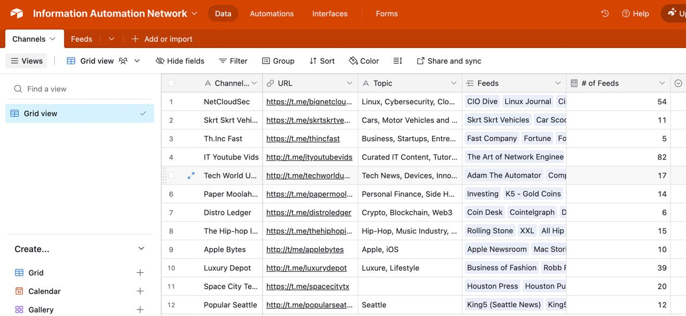
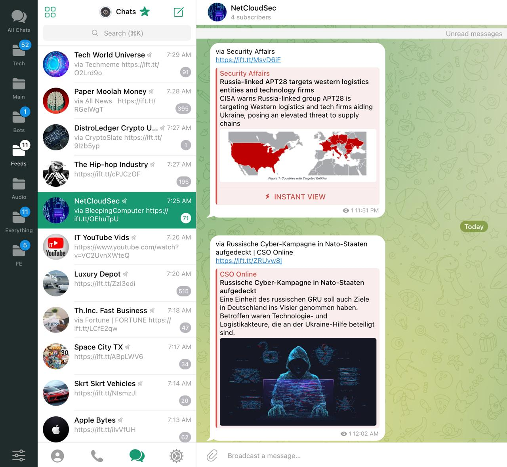

# 🔄 Telegram Galaxies: Information Automation Network

A **no-code/low-code automation system** that curates real-time, high-quality content across multiple topics from over **300 trusted sources**—including RSS feeds, YouTube channels, and Twitter accounts—into a network of **15+ themed Telegram channels**.

This project demonstrates how **systems thinking**, **automation**, and **structured data workflows** can deliver real-world value without traditional software development.

---

### 📌 Project Overview

I built a fully automated, no-code/low-code system that curates and distributes content across a network of 15+ Telegram channels, pulling from 300+ trusted sources. Topics are organized into distinct themes for **focused delivery**.

Beyond the technical achievement, it’s a tool for **intentional information consumption**. Instead of drinking from a firehose, this system lets me **control the pressure**.

---

### 🧰 Tech Stack

* **IFTTT** – no-code automation engine
* **[Airtable](https://airtable.com/app05bkDJYe0QlzpQ/shrc39DY82sHIMNj4)** – for database for structuring + curation
* **Telegram API** (no-code)
* **RSS** – news, blogs, official feeds
* **Manual review** + logic layering
* **Fully no-code/low-code framework**

---

### 🔧 Key Features

- **Smart Aggregation**: Pulls from 300+ sources (RSS, YouTube, Twitter) into a centralized ecosystem
- **Topic-Based Distribution**: Divides content into thematic Telegram channels—**no noise, just signal**
- **Fully Automated**: Uses IFTTT + Telegram for hands-free content flow
- **Scalable Architecture**: Easy to update with new sources and formats

---

### 🧠 What It Demonstrates

- **Efficient Info Flow** – saves time, reduces noise, keeps you current
- **Automation Strategy** – scalable results without coding
- **Content Discipline** – focused curation beats algorithmic chaos
- **Creative Problem-Solving** – a personal solution to staying informed intentionally

---

### ⚙️ How It Works

1. Collect feed URLs from trusted sources (e.g., Microsoft Security Blog, Krebs on Security, etc.)
2. Use **IFTTT** RSS → Telegram applets to:
    - Monitor feeds for updates
    - Auto-send title + link to a matching Telegram channel
3. Replace or refine sources based on relevance or quality

**Example Applet**:

If new item in `microsoft.com/security/blog`, then post to `@CybersecurityUniverse`

---

### 🌐 Content Sources

- RSS feeds (official blogs, threat intel, news outlets)
- YouTube uploads & playlists
- Twitter accounts (via IFTTT)

---

1. **📡 NetCloudSec** 
   *Topic:* Linux, Cybersecurity, Cloud, Networking, Programming 
   🔗 [t.me/bignetcloudsec](https://t.me/bignetcloudsec)

2. **💼 Th.Inc Fast** 
   *Topic:* Business, Startups, Entrepreneurship 
   🔗 [t.me/thincfast](https://t.me/thincfast)

3. **🚘 Skrt Skrt Vehicles** 
   *Topic:* Cars, Motorcycles, Transportation 
   🔗 [t.me/skrtskrtvehicles](https://t.me/skrtskrtvehicles)

4. **💻 IT YouTube Vids** 
   *Topic:* Curated IT Content, Tutorials, Networking 
   🔗 [t.me/ityoutubevids](https://t.me/ityoutubevids)

5. **📱 Tech World Universe** 
   *Topic:* Tech News, Devices, Innovation 
   🔗 [t.me/techworlduniverse](https://t.me/techworlduniverse)

6. **💰 Paper Moolah Money** 
   *Topic:* Personal Finance, Side Hustles, Investing
   🔗 [t.me/papermoolah](https://t.me/papermoolah)

7. **🏙️ Space City Texas** 
   *Topic:* Houston News, Culture, Weather 
   🔗 [t.me/spacecitytx](https://t.me/spacecitytx)

8. **📰 Mustard Seed News** 
   *Topic:* Christian News, Uplifting Stories 
   🔗 [t.me/mustardseednews](https://t.me/mustardseednews)

9. **🪙 Distro Ledger** 
   *Topic:* Crypto, Blockchain, Web3 
   🔗 [t.me/distroledger](https://t.me/distroledger)

10. **🍏 Apple Bytes** 
    *Topic:* Apple News, iOS Updates, Ecosystem 
    🔗 [t.me/applebytes](https://t.me/applebytes)

11. **💎 Luxury Depot** 
    *Topic:* Luxury Lifestyle, Fashion, Brands 
    🔗 [t.me/luxurydepot](https://t.me/luxurydepot)

12. **🌧️ Popular Seattle** 
    *Topic:* Seattle News, Culture, Weather 
    🔗 [t.me/popularseattle](https://t.me/popularseattle)

13. **🔍 Google Bits** 
    *Topic:* Google, Android, AI, Search 
    🔗 [t.me/googlebits](https://t.me/googlebits)

14. **✊🏿 Blackity Black News** 
    *Topic:* Black Culture, Community News & Entertainment 
    🔗 [t.me/blackityblacknews](https://t.me/blackityblacknews)

15. **🏆 Texas Government** 
    *Topic:* Texas Legislature, Laws, Meetings, News 
    🔗 [t.me/texasgovt](https://t.me/texasgovt)

16. **🎤 The Hip-Hop Industry** 
    *Topic:* Hip-Hop, Music Industry, Street Fashion 
    🔗 [t.me/thehiphopindustry](https://t.me/thehiphopindustry)

17. **🚁 Drone Science** 
    *Topic:* Drone Racing, Flying, Culture, Learning 
    🔗 [t.me/dronescience](https://t.me/dronescience)

---

**[🔗Airtable Channel Directory Screenshot (link to real time Airtable database here) ](https://airtable.com/app05bkDJYe0QlzpQ/shrc39DY82sHIMNj4)**    

 
 

**Live Telegram Channel Screenshot**  
 

---

### 📫 Contact / Collaborate

This project is part of my **daily workflow** and continues to evolve.

If you'd like [**access to the system**](https://airtable.com/app05bkDJYe0QlzpQ/shrc39DY82sHIMNj4), a custom channel, or want help building your own **automated curation network**, feel free to reach out.
